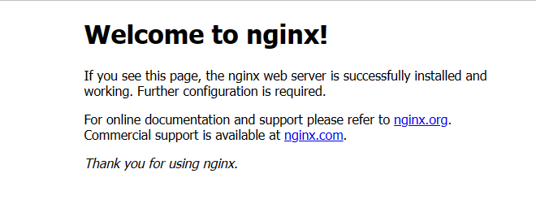
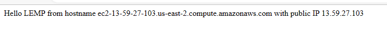

## project 2 documentation

`sudo apt update `
`sudo apt install nginx`
`sudo systemctl status nginx`

Step 1 – Installing the Nginx Web Server
In order to display web pages to our site visitors, we are going to employ Nginx, a high-performance web server. We’ll use the apt package manager to install this package.

Since this is our first time using apt for this session, start off by updating your server’s package index. Following that, you can use apt install to get Nginx installed:

$sudo apt update
$sudo apt install nginx
When prompted, enter Y to confirm that you want to install Nginx. Once the installation is finished, the Nginx web server will be active and running on your Ubuntu 20.04 server.

To verify that nginx was successfully installed and is running as a service in Ubuntu, run:

$sudo systemctl status nginx
If it is green and running, then you did everything correctly – you have just launched your first Web Server in the Clouds!

Before we can receive any traffic by our Web Server, we need to open TCP port 80 which is default port that web browsers use to access web pages in the Internet.

As we know, we have TCP port 22 open by default on our EC2 machine to access it via SSH, so we need to add a rule to EC2 configuration to open inbound connection through port 80:
Our server is running and we can access it locally and from the Internet (Source 0.0.0.0/0 means ‘from any IP address’).

First, let us try to check how we can access it locally in our Ubuntu shell, run:

$ curl http://localhost:80
or
$ curl http://127.0.0.1:80
These 2 commands above actually do pretty much the same – they use ‘curl’ command to request our Nginx on port 80 (actually you can even try to not specify any port – it will work anyway). The difference is that: in the first case we try to access our server via DNS name and in the second one – by IP address (in this case IP address 127.0.0.1 corresponds to DNS name ‘localhost’ and the process of converting a DNS name to IP address is called “resolution”). We will touch DNS in further lectures and projects.

As an output you can see some strangely formatted test, do not worry, we just made sure that our Nginx web service responds to ‘curl’ command with some payload.

Now it is time for us to test how our Nginx server can respond to requests from the Internet. Open a web browser of your choice and try to access following url

http://<Public-IP-Address>:80
Another way to retrieve your Public IP address, other than to check it in AWS Web console, is to use following command:

curl -s http://169.254.169.254/latest/meta-data/public-ipv4
The URL in browser shall also work if you do not specify port number since all web browsers use port 80 by default.

    step 2
	`sudo apt install mysql-server`

    Now that you have a web server up and running, you need to install a Database Management System (DBMS) to be able to store and manage data for your site in a relational database. MySQL is a popular relational database management system used within PHP environments, so we will use it in our project.

Again, use ‘apt’ to acquire and install this software:

$ sudo apt install mysql-server
When prompted, confirm installation by typing Y, and then ENTER.

When the installation is finished, log in to the MySQL console by typing:

$ sudo mysql
This will connect to the MySQL server as the administrative database user root, which is inferred by the use of sudo when running this command. You should see output like this:

Welcome to the MySQL monitor.  Commands end with ; or \g.
Your MySQL connection id is 11
Server version: 8.0.22-0ubuntu0.20.04.3 (Ubuntu)

Copyright (c) 2000, 2020, Oracle and/or its affiliates. All rights reserved.

Oracle is a registered trademark of Oracle Corporation and/or its
affiliates. Other names may be trademarks of their respective
owners.

Type 'help;' or '\h' for help. Type '\c' to clear the current input statement.

mysql> 
It’s recommended that you run a security script that comes pre-installed with MySQL. This script will remove some insecure default settings and lock down access to your database system. Before running the script you will set a password for the root user, using mysql_native_password as default authentication method. We’re defining this user’s password as PassWord.1.

ALTER USER 'root'@'localhost' IDENTIFIED WITH mysql_native_password BY 'PassWord.1';
Exit the MySQL shell with:

mysql> exit

If you see following page, then your web server is now correctly installed and accessible through your firewall.

In fact, it is the same content that you previously got by ‘curl’ command, but represented in nice HTML formatting by your web browser.

step 3

`sudo apt install php-fpm php-mysql`
`sudo mkdir /var/www/projectLEMP`
`sudo chown -R $USER:$USER /var/www/projectLEMP`
#/etc/nginx/sites-available/projectLEMP

server {
    listen 80;
    server_name projectLEMP www.projectLEMP;
    root /var/www/projectLEMP;

    index index.html index.htm index.php;

    location / {
        try_files $uri $uri/ =404;
    }

    location ~ \.php$ {
        include snippets/fastcgi-php.conf;
        fastcgi_pass unix:/var/run/php/php8.1-fpm.sock;
     }

    location ~ /\.ht {
        deny all;
    }

}
Here’s what each of these directives and location blocks do:

listen — Defines what port Nginx will listen on. In this case, it will listen on port 80, the default port for HTTP.
root — Defines the document root where the files served by this website are stored.
index — Defines in which order Nginx will prioritize index files for this website. It is a common practice to list index.html files with a higher precedence than index.php files to allow for quickly setting up a maintenance landing page in PHP applications. You can adjust these settings to better suit your application needs.
server_name — Defines which domain names and/or IP addresses this server block should respond for. Point this directive to your server’s domain name or public IP address.
location / — The first location block includes a try_files directive, which checks for the existence of files or directories matching a URI request. If Nginx cannot find the appropriate resource, it will return a 404 error.
location ~ \.php$ — This location block handles the actual PHP processing by pointing Nginx to the fastcgi-php.conf configuration file and the php7.4-fpm.sock file, which declares what socket is associated with php-fpm.
location ~ /\.ht — The last location block deals with .htaccess files, which Nginx does not process. By adding the deny all directive, if any .htaccess files happen to find their way into the document root ,they will not be served to visitors.
When you’re done editing, save and close the file. If you’re using nano, you can do so by typing CTRL+X and then y and ENTER to confirm.

Activate your configuration by linking to the config file from Nginx’s sites-enabled directory:

sudo ln -s /etc/nginx/sites-available/projectLEMP /etc/nginx/sites-enabled/
This will tell Nginx to use the configuration next time it is reloaded. You can test your configuration for syntax errors by typing:

sudo nginx -t
You shall see following message:

nginx: the configuration file /etc/nginx/nginx.conf syntax is ok
nginx: configuration file /etc/nginx/nginx.conf test is successful
If any errors are reported, go back to your configuration file to review its contents before continuing.

We also need to disable default Nginx host that is currently configured to listen on port 80, for this run:

sudo unlink /etc/nginx/sites-enabled/default
When you are ready, reload Nginx to apply the changes:

sudo systemctl reload nginx
Your new website is now active, but the web root /var/www/projectLEMP is still empty. Create an index.html file in that location so that we can test that your new server block works as expected:

sudo echo 'Hello LEMP from hostname' $(curl -s http://169.254.169.254/latest/meta-data/public-hostname) 'with public IP' $(curl -s http://169.254.169.254/latest/meta-data/public-ipv4) > /var/www/projectLEMP/index.html
Now go to your browser and try to open your website URL using IP address:

http://<Public-IP-Address>:80
If you see the text from ‘echo’ command you wrote to index.html file, then it means your Nginx site is working as expected.
In the output you will see your server’s public hostname (DNS name) and public IP address. You can also access your website in your browser by public DNS name, not only by IP – try it out, the result must be the same (port is optional)

http://<Public-DNS-Name>:80
You can leave this file in place as a temporary landing page for your application until you set up an index.php file to replace it. Once you do that, remember to remove or rename the index.html file from your document root, as it would take precedence over an index.php file by default.

Your LEMP stack is now fully configured. In the next step, we’ll create a PHP script to test that Nginx is in fact able to handle .php files within your newly configured website.

STEP 6 – RETRIEVING DATA FROM MYSQL DATABASE WITH PHP (CONTINUED)

In this step you will create a test database (DB) with simple “To do list” and configure access to it, so the Nginx website would be able to query data from the DB and display it.

At the time of this writing, the native MySQL PHP library mysqlnd doesn’t support caching_sha2_authentication, the default authentication method for MySQL 8. We’ll need to create a new user with the mysql_native_password authentication method in order to be able to connect to the MySQL database from PHP.

We will create a database named example_database and a user named example_user, but you can replace these names with different values.

First, connect to the MySQL console using the root account:

sudo mysql
To create a new database, run the following command from your MySQL console:

mysql> CREATE DATABASE `example_database`;
Now you can create a new user and grant him full privileges on the database you have just created.

The following command creates a new user named example_user, using mysql_native_password as default authentication method. We’re defining this user’s password as password, but you should replace this value with a secure password of your own choosing.

mysql>  CREATE USER 'example_user'@'%' IDENTIFIED WITH mysql_native_password BY 'password';
Now we need to give this user permission over the example_database database:

mysql> GRANT ALL ON example_database.* TO 'example_user'@'%';
This will give the example_user user full privileges over the example_database database, while preventing this user from creating or modifying other databases on your server.

Now exit the MySQL shell with:

mysql> exit
You can test if the new user has the proper permissions by logging in to the MySQL console again, this time using the custom user credentials:

mysql -u example_user -p
Notice the -p flag in this command, which will prompt you for the password used when creating the example_user user. After logging in to the MySQL console, confirm that you have access to the example_database database:

mysql> SHOW DATABASES;
This will give you the following output:

Output
+--------------------+
| Database           |
+--------------------+
| example_database   |
| information_schema |
+--------------------+
2 rows in set (0.000 sec)
Next, we’ll create a test table named todo_list. From the MySQL console, run the following statement:

CREATE TABLE example_database.todo_list (item_id INT AUTO_INCREMENT,content VARCHAR(255),PRIMARY KEY(item_id));
Insert a few rows of content in the test table. You might want to repeat the next command a few times, using different VALUES:

mysql> INSERT INTO example_database.todo_list (content) VALUES ("My first important item");
To confirm that the data was successfully saved to your table, run:

mysql>  SELECT * FROM example_database.todo_list;
You’ll see the following output:

Output
+---------+--------------------------+
| item_id | content                  |
+---------+--------------------------+
|       1 | My first important item  |
|       2 | My second important item |
|       3 | My third important item  |
|       4 | and this one more thing  |
+---------+--------------------------+
4 rows in set (0.000 sec)
After confirming that you have valid data in your test table, you can exit the MySQL console:

mysql> exit
Now you can create a PHP script that will connect to MySQL and query for your content. Create a new PHP file in your custom web root directory using your preferred editor. We’ll use vi for that:

nano /var/www/projectLEMP/todo_list.php
The following PHP script connects to the MySQL database and queries for the content of the todo_list table, displays the results in a list. If there is a problem with the database connection, it will throw an exception.

Copy this content into your todo_list.php script:

<?php
$user = "example_user";
$password = "password";
$database = "example_database";
$table = "todo_list";

try {
  $db = new PDO("mysql:host=localhost;dbname=$database", $user, $password);
  echo "<h2>TODO</h2><ol>";
  foreach($db->query("SELECT content FROM $table") as $row) {
    echo "<li>" . $row['content'] . "</li>";
  }
  echo "</ol>";
} catch (PDOException $e) {
    print "Error!: " . $e->getMessage() . " ";
    die();
}
Save and close the file when you are done editing.

You can now access this page in your web browser by visiting the domain name or public IP address configured for your website, followed by /todo_list.php:

http://<Public_domain_or_IP>/todo_list.php
You should see a page like this, showing the content you’ve inserted in your test table:

